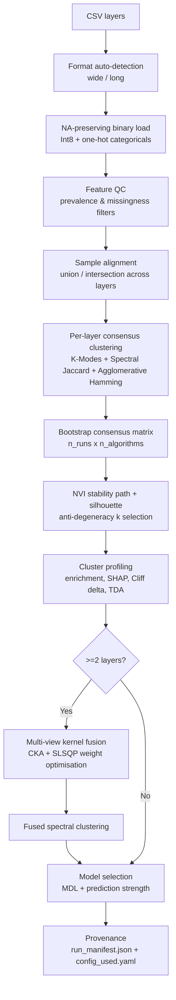

# bact-trait-cluster

[](https://github.com/MK-vet/bact-trait-cluster/actions/workflows/ci.yaml)
[](https://pypi.org/project/bact-trait-cluster/)
[](https://pypi.org/project/bact-trait-cluster/)
[](LICENSE)

Multi-algorithm consensus clustering with topological validation for binary genotype-phenotype matrices.

## Pipeline Architecture



## Analyses Performed

### Data Ingestion & Quality Control

1. **Multi-format CSV loading** — automatic detection of wide (samples x features) vs long (tidy) format
2. **NA-preserving binary coercion** — nullable Int8 dtype; categorical columns one-hot encoded; missing values never coerced to 0
3. **Feature QC filtering** — removes features below prevalence threshold or above missingness threshold (user-configurable)
4. **Layer coverage reporting** — per-layer: N_total, N_observed, coverage fraction, missing cell count
5. **Sample alignment** — union (all samples, fill missing) or intersection (only shared samples) across layers

### Consensus Clustering

6. **K-Modes clustering** — Hamming distance, Huang initialisation (Huang 1998)
7. **Spectral clustering** — Jaccard similarity kernel, eigendecomposition + KMeans on spectral embedding
8. **Agglomerative clustering** — Hamming distance, average linkage
9. **Bootstrap consensus matrix** — n_runs x n_algorithms co-association frequency matrix
10. **Consensus label extraction** — hierarchical clustering on 1-consensus dissimilarity (spectral fallback)
11. **NVI stability paths** — Normalised Variation of Information with 95% CI bands via split-half cross-validation (Meila 2007)
12. **Silhouette score** — computed on Hamming distance per k
13. **Anti-degeneracy k selection** — lexicographic criterion: penalty flag, NVI, -silhouette
14. **Sensitivity: k-selection robustness** — stability of selected k across penalty parameter values
15. **Sensitivity: consensus convergence** — consensus stability vs n_runs (MAD convergence criterion)
16. **Algorithm validation** — verifies clustering algorithms meet the required interface; supports custom algorithm registration

### Cluster Profiling

17. **Feature enrichment z-scores** — adaptive test selection (z-test or Fisher exact by sample size) with Benjamini-Hochberg FDR correction
18. **Cliff's delta effect sizes** — nonparametric effect size with bootstrap confidence intervals + magnitude classification (negligible/small/medium/large)
19. **SHAP feature importance** — TreeSHAP via LightGBM one-vs-rest classifier with bootstrap CI (optional dependency)
20. **Persistent homology** — Vietoris-Rips complex on Hamming distance; outputs Betti numbers, total persistence, persistence entropy (optional dependency: ripser)
21. **Feature-partition NMI** — per-feature mutual information with the cluster partition
22. **Partition information summary** — unexplained bits (total information not captured by clustering)
23. **Assignment confidence** — within-cluster vs best-other consensus scores per sample

### Multi-view Fusion (>=2 layers)

24. **Jaccard kernel construction** — per-layer pairwise Jaccard similarity matrix
25. **CKA matrix** — Centered Kernel Alignment between all layer pairs (Kornblith et al. 2019)
26. **Optimised kernel weight fusion** — SLSQP optimisation with spectral gap objective
27. **Fused spectral clustering** — spectral clustering on the weighted kernel combination

### Model Selection

28. **MDL (Minimum Description Length)** — two-part code length: L_data (encoding data given partition) + L_model (encoding partition)
29. **MDL path** — MDL across all candidate k values
30. **Prediction strength** — split-half cross-validation, per-k (Tibshirani & Walther 2005)

### Cross-layer Concordance

31. **Layer concordance** — ARI, NMI, Variation of Information between all layer pairs
32. **Hungarian label matching** — optimal label alignment between layer partitions
33. **Integrated cluster assignment table** — all layers + fused labels in single output

### Phylogenetic Validation (optional)

34. **Phylogenetic cluster purity** — between/within cophenetic distance ratio with permutation test (requires tree file)

### Provenance

35. **Config validation** — schema check, unknown key detection, strict mode
36. **Run manifest** — SHA256 input hashes, package versions, platform, random seed, config snapshot

## Complete Output Files

| File | Description |
|------|-------------|
| `stability_path.csv` | NVI and silhouette per k with 95% CI |
| `clusters.csv` | Final cluster assignments per layer |
| `consensus_matrix.npy` | Bootstrap co-association matrix |
| `assignment_confidence.csv` | Within-cluster vs best-other consensus scores |
| `enrichment_z.csv` | Feature enrichment z-scores with FDR-corrected p-values |
| `cliff_delta.csv` | Effect sizes with bootstrap CI and magnitude class |
| `shap.csv` | SHAP importance values with bootstrap CI |
| `persistence_diagram.csv` | Birth-death pairs from Vietoris-Rips filtration |
| `tda_summary.csv` | Betti numbers, total persistence, persistence entropy |
| `phylo_purity.csv` | Phylogenetic cluster purity and permutation p-value |
| `layer_coverage.csv` | Per-layer sample counts and coverage fractions |
| `feature_qc.csv` | Per-feature prevalence, missingness, pass/fail |
| `integrated_clusters.csv` | All layer and fused cluster labels |
| `layer_concordance.csv` | ARI, NMI, VI between layer pairs |
| `layer_label_matching.csv` | Hungarian-aligned label mapping |
| `fused_consensus.npy` | Fused consensus co-association matrix |
| `fused_clusters.csv` | Fused cluster assignments |
| `fused_mdl_path.csv` | MDL values across k candidates |
| `layer_weights.csv` | Optimised kernel fusion weights |
| `cka_matrix.csv` | Pairwise CKA between layers |
| `fused_mode_summary.csv` | Fusion method and parameters used |
| `prediction_strength.csv` | Prediction strength per k |
| `partition_info.csv` | Total and unexplained information bits |
| `{layer}_feature_partition_nmi.csv` | Per-feature NMI with partition |
| `sensitivity_k_penalty.csv` | k stability across penalty values |
| `sensitivity_consensus_nruns.csv` | Consensus MAD convergence |
| `config_used.yaml` | Exact configuration snapshot |
| `run_manifest.json` | Provenance: hashes, versions, platform, seed |
| `config_validation.json` | Schema validation results |

## Installation

```bash
pip install bact-trait-cluster
pip install bact-trait-cluster[all]       # all optional features
```

Optional feature groups:

| Extra | Packages | Features |
|-------|----------|----------|
| `kmodes` | kmodes>=0.12 | K-Modes algorithm |
| `shap` | shap>=0.43, lightgbm>=4.0 | SHAP feature importance |
| `tda` | ripser>=0.6 | Persistent homology |
| `gui` | marimo>=0.9, plotly>=5.18, matplotlib>=3.7 | Interactive dashboard |
| `dev` | pytest>=7, pytest-cov>=4, ruff>=0.4 | Development & testing |

## Quick Start

### CLI

```bash
bact-trait-cluster config.yaml -v
```

### Python API

```python
from bacttraitcluster.config import Config
from bacttraitcluster.pipeline import Pipeline

cfg = Config.from_yaml("config.yaml")
results = Pipeline(cfg).run()
```

## Interactive Dashboard (marimo)

```bash
bact-trait-cluster-dashboard
bact-trait-cluster-dashboard --edit   # edit mode
```

## CLI Reference

| Argument | Description |
|----------|-------------|
| `config` | Path to YAML configuration file (positional) |
| `-o`, `--output-dir` | Output directory (default: `results/`) |
| `-v`, `--verbose` | Verbose logging |
| `--seed` | Random seed for reproducibility |
| `--n-runs` | Number of bootstrap runs (overrides config) |
| `--k-min` | Minimum k to evaluate (overrides config) |
| `--k-max` | Maximum k to evaluate (overrides config) |
| `--skip-shap` | Skip SHAP computation |
| `--skip-tda` | Skip persistent homology |
| `--skip-phylo` | Skip phylogenetic validation |
| `--selfcheck` | Run self-check on synthetic data and exit |
| `--benchmark` | Run performance benchmark and exit |
| `--version` | Show version and exit |

## Configuration

```yaml
layers:
  - name: AMR_genes
    path: data/AMR_genes.csv
  - name: Virulence
    path: data/Virulence.csv

clustering:
  k_min: 2
  k_max: 10
  n_runs: 100
  algorithms: [kmodes, spectral, agglomerative]
  penalty: 1.0

qc:
  min_prevalence: 0.01
  max_missingness: 0.5

fusion:
  mode: auto        # auto | spectral | consensus
  alignment: union   # union | intersection

tree:                # optional
  path: data/tree.nwk
  format: newick
```

See `examples/config.yaml` for a complete template.

## Data Quality & Reliability

- **Dataset preflight** — coverage, duplicates, missing data audit, SHA256 checksums
- **Feature informativeness index** — entropy, variance, prevalence per feature
- **Degeneracy detection** — flags constant features and all-missing columns
- **Pairwise ID overlap** — Jaccard index and recall across layers
- **Quality gate** — PASS / WARN / FAIL with configurable thresholds
- **Sensitivity mini-runs** — subsampling stability proxy
- **Cross-tool consistency** — ARI, NMI, bias-corrected Cramer's V against other tools

## Reproducibility

Every run produces:

- `run_manifest.json` — tool version, Python version, platform, random seed, input file SHA256 hashes, installed package versions, full config snapshot
- `config_used.yaml` — exact configuration used for the run
- `config_validation.json` — schema validation results with warnings for unknown keys

## Scope

**What this tool does:**
Consensus clustering of binary genotype-phenotype matrices with multi-view fusion, topological validation, and comprehensive profiling.

**What this tool does NOT do:**
Network construction (see bact-assoc-net), MDR classification (see bact-mdr-profiler), phylogenetic comparative methods (see bact-phylo-trait). Each tool has a distinct analytical scope with no overlapping computations.

## Testing

```bash
pip install -e ".[dev]"
pytest tests/ -v
```

## How to Cite

If you use bact-trait-cluster in your research, please cite:

> Kochanowski M. bact-trait-cluster: multi-algorithm consensus clustering with topological validation for binary genotype-phenotype matrices. https://github.com/MK-vet/bact-trait-cluster

## License

MIT
